# **Personal Health Management Website**

## **Overview**
The Personal Health Management Website is an application that helps people track, manage, and visualize their health data. The system allows users to record various health indicators, access health-related news, receive notifications, and interact with other users through comments and discussions.


## **Technology Stack**

### **Backend**
- Spring Boot
- Spring MVC
- MyBatis

### **Frontend**
- Vue.js
- Axios
- Router

### **Database**
- MySQL

## **Features**

### **User Management**
- User registration & login
- Role-based access control (User/Admin)
- Profile updates & password changes

### **Health Tracking**
- Record and visualize health indicators (height, weight, blood pressure, blood sugar, steps, etc.)
- Personalized health model configurations

### **Health Information & Community**
- View, search, and filter health-related news
- Like, comment, and save health articles
- Tag-based article categorization

### **Notifications & Messaging**
- System notifications for health updates and user interactions
- Interactive message notifications


## **Setup Instructions**

### **Backend Setup**
1. **Configure Maven** and install dependencies.
2. **Set up MySQL database** and update connection in `resources/application.yml`.
3. **Run the backend service**:
   - Run `PersonalHealthApplication.java` 
4. **Successful startup confirmation**.

### **Frontend Setup**
1. **Navigate to the frontend directory**:
```
cd src
```
2. **Install dependencies**:
```
npm i
```

3. **Run the frontend application**:
```
npm run dev
```

4. **Access the application by opening the displayed local development URL in your browser**.


## **📸 Project Showcase**

### **User Login**
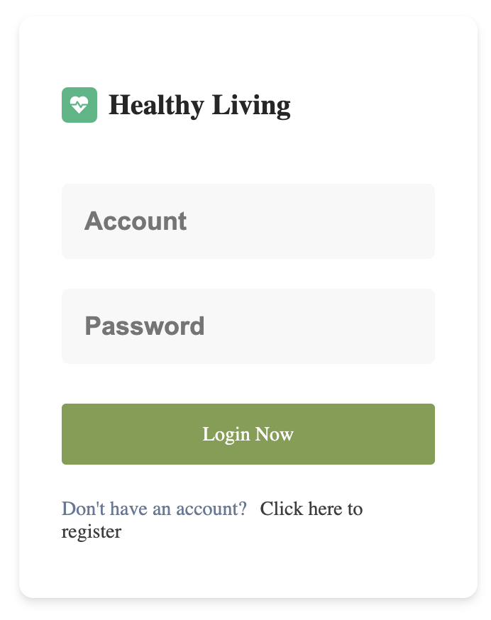

### **Health News List**
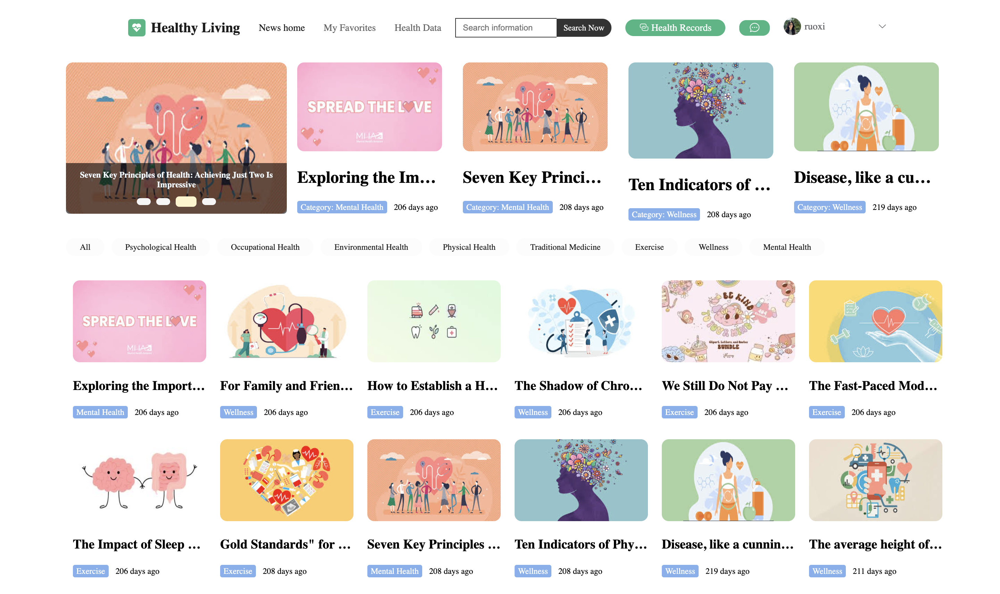

### **News Details**
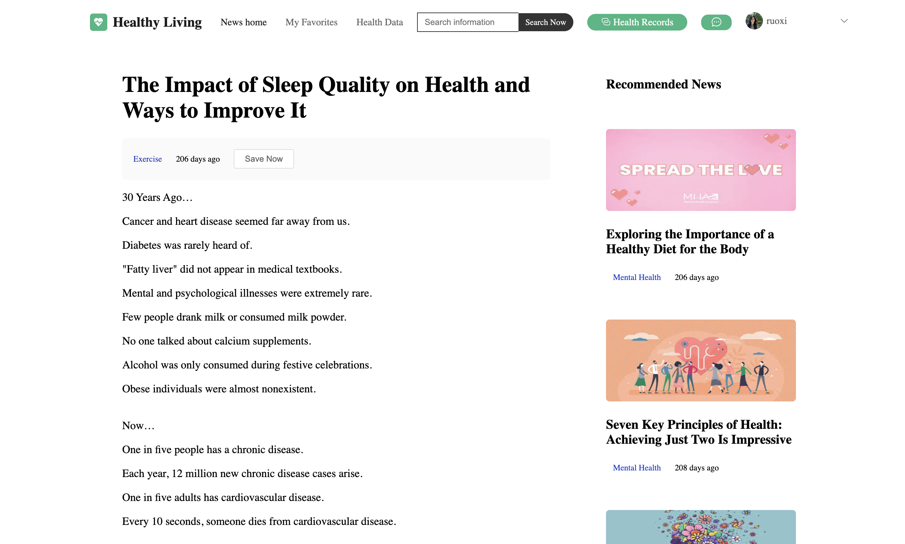

### **News Favorites**
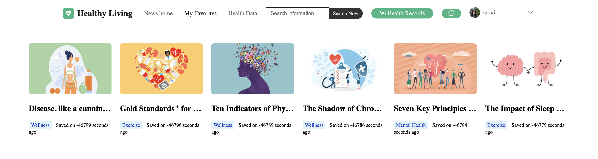

### **Model Management and Indicator Documentation**
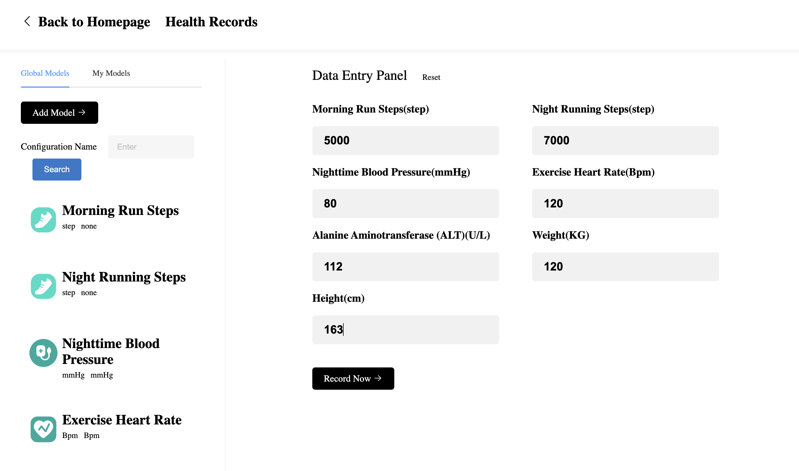

### **Message Notifications**
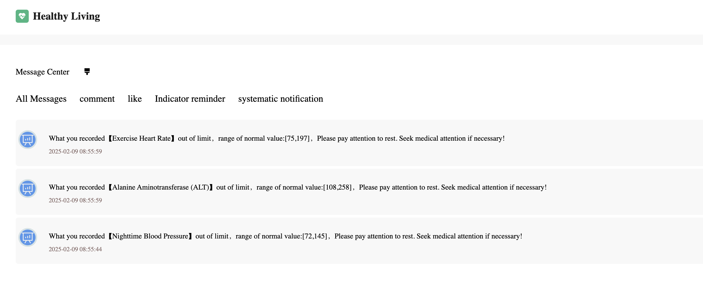

### **Health Indicator Visualization**
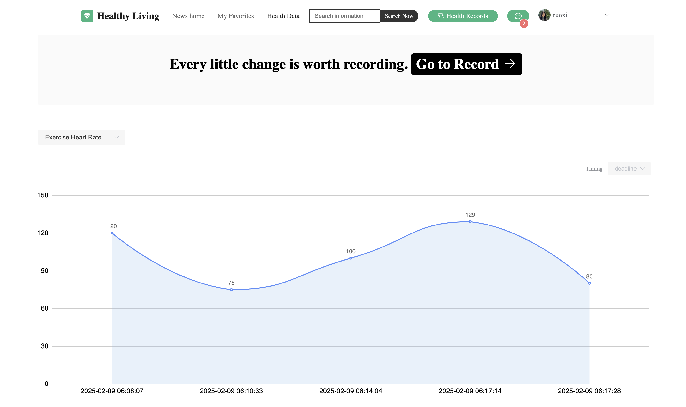

## **Admin Panel**

### **Home Page Visualization**
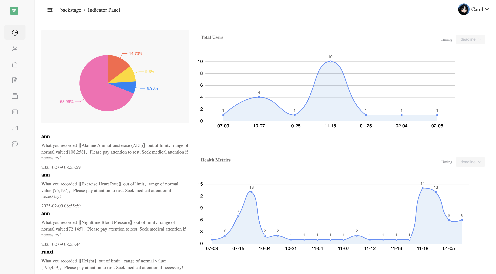

### **User Management**
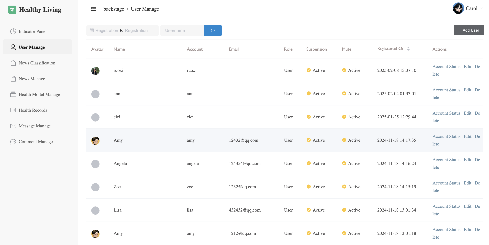

### **News Classification**
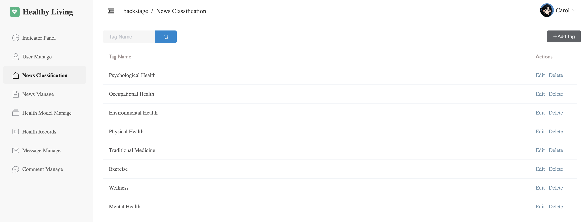

### **News Management**
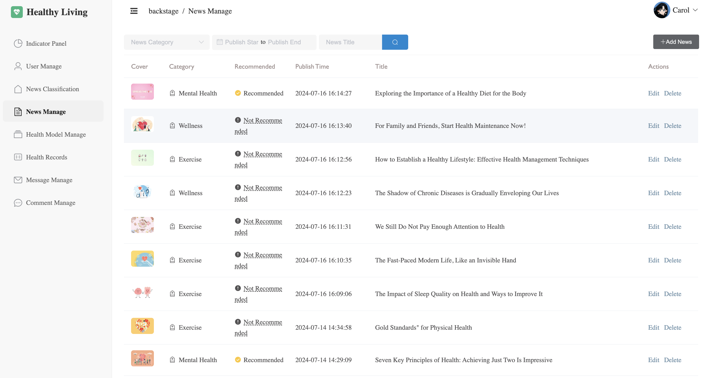

### **Health Model Management**
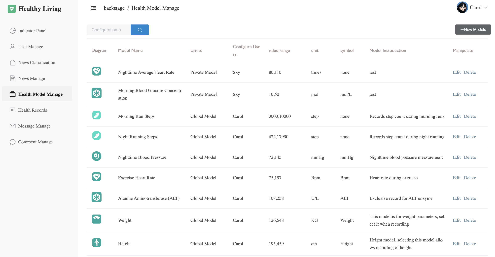


## 🚀 Start tracking your health today with the Personal Health Management Website!
